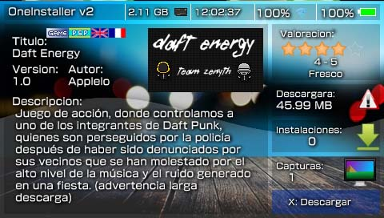

# OneInstaller

OneInstaller, the wiki Homebrew!

-

OneInstaller is powered by ONElua "Lua Interpreter for PSP".
Written By Davis Nuñez in 2015 (c).

Is a Autoinstaller content via Red, with simple but powerful GUI for psp!

This is an example of using APIs http to http download and send information through sockets.

It is an old project but suppose someone will serve you something to learn using http requests, or simply to understand the code of curiosity.

Bug´s:
It does not work well at all in models PSP Go!
